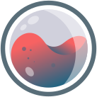

<h3><a href="https://gallery.roosta.sh">gallery.roosta.sh</a></h3>

Personal gallery for various works I've done over the years, some new, some old.

## Running Locally

1. Install dependencies:
    ```sh
    npm install
    ```
2. Running the development server:
    ```sh
    npm run dev
    ```
Runs a live reload Vite server, see `stdout` for port, point your browser to localhost.

## Libraries

- [Vite](https://vitejs.dev/)
- [TailwindCSS](https://tailwindcss.com)
- [Handlebars](https://handlebarsjs.com/)

## Building for production

- [Vite documentation](https://vitejs.dev/guide/build.html)

To build for production:

```shell
npm run build
```

If you want to serve the dist output you can run:

```shell
npm run preview
```

> NOTE: ./dist folder needs to be built for the preview server to work


## License

Copyright © 2016 Daniel Berg

- Source code from 2024 onward is distributed under [GNU General Public License v3.0](LICENSE) or later.

**NO AI TRAINING**: Without in any way limiting the artist’s exclusive rights
under copyright, any use of this gallery to "train" generative artificial
intelligence (AI) technologies to generate artwork is expressly prohibited. The
artist reserves all rights to license uses of this work for generative AI
training and development of machine learning generative models.

